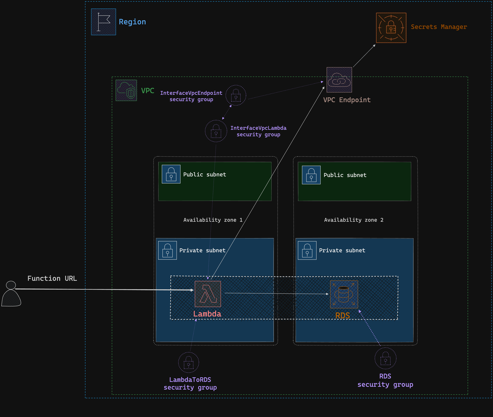

# Lambda-Vpc-RDS configuration

Configure your Lambda function to access Amazon RDS database in VPC using AWS CDK and Golang.

## Prerequisites

* Golang: `https://go.dev/doc/install`
* AWS CDK: `npm install -g aws-cdk`
* AWS CLI credentials: `https://docs.aws.amazon.com/cli/latest/userguide/cli-configure-files.html` 

## Commands:

* Deploy: `cdk deploy --all`
* Destroy: `cdk destroy --all`

# Test db connection

When stack is deployed you can trigger the lambda function via function url, available in the CDK outputs,

with `curl <function-url>`

## Problem diagram

